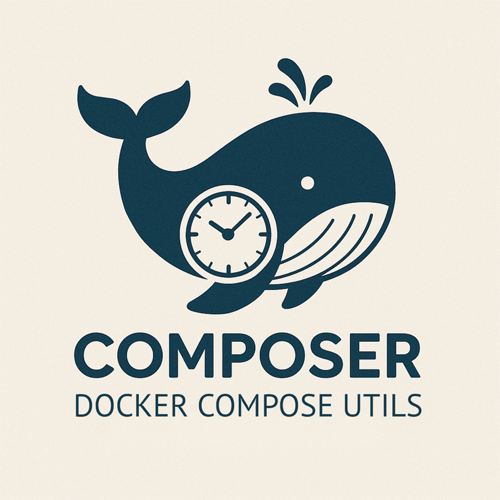

<p align="center">
  
</p>

<h3 align="center">Cron for Docker Compose</h3>

<p align="center">
  Schedule any Docker Compose service to run or restart on a cron schedule —<br>
  no crontab editing, no wrapper scripts, just labels.
</p>

<p align="center">
  <a href="https://github.com/architect-xyz/composer/releases/latest"></a>
  <a href="LICENSE"></a>
  <a href="https://hub.docker.com/r/afintech/composer"></a>
</p>

---

```yaml
# Just add a label to your compose service:
services:
  backup:
    image: my-backup:latest
    labels:
      - "co.architect.composer.run=0 0 2 * * *"   # runs every day at 2 AM
```

```bash
# Install and start:
curl -fsSL https://raw.githubusercontent.com/architect-xyz/composer/main/install.sh | sh
composer install bash      # shell aliases for common docker compose commands
composer install systemd   # or: composer install launchd
```

That's it. Composer watches your `compose.yml`, picks up labeled services, and runs them on schedule.

---

## Why Composer?

**The problem:** You need to run Docker Compose services on a schedule — nightly backups, periodic ETL jobs, service restarts. The usual options are:

- **Crontab + shell scripts** — works, but cron entries are disconnected from your compose file. They drift, break silently, and don't travel with your project.
- **Kubernetes CronJobs** — great if you're on Kubernetes. Overkill if you're running Docker Compose on a single server or small cluster.
- **Other schedulers** (Ofelia, Swarm, etc.) — often require running as a privileged container with Docker socket access, complex volume mounts, or a separate config file.

## Installation

### One-line install 

```bash
curl -fsSL https://raw.githubusercontent.com/architect-xyz/composer/main/install.sh | sh
```

### Manual binary download

```bash
# Linux (amd64)
mkdir -p ~/.local/bin
curl -fsSL https://github.com/architect-xyz/composer/releases/latest/download/composer-linux-amd64 \
  -o ~/.local/bin/composer && chmod +x ~/.local/bin/composer

# Linux (arm64)
mkdir -p ~/.local/bin
curl -fsSL https://github.com/architect-xyz/composer/releases/latest/download/composer-linux-arm64 \
  -o ~/.local/bin/composer && chmod +x ~/.local/bin/composer

# macOS (Apple Silicon)
mkdir -p ~/.local/bin
curl -fsSL https://github.com/architect-xyz/composer/releases/latest/download/composer-darwin-arm64 \
  -o ~/.local/bin/composer && chmod +x ~/.local/bin/composer

# macOS (Intel)
mkdir -p ~/.local/bin
curl -fsSL https://github.com/architect-xyz/composer/releases/latest/download/composer-darwin-amd64 \
  -o ~/.local/bin/composer && chmod +x ~/.local/bin/composer
```

> **Note:** Ensure `~/.local/bin` is in your `PATH`. Add `export PATH="$HOME/.local/bin:$PATH"` to your shell profile if needed. To install system-wide, use `--to /usr/local/bin` with the install script (requires sudo).

### Docker

```bash
docker pull afintech/composer:latest
```

See [docs/docker.md](docs/docker.md) for the container-based setup.

## Quick start

```bash
# Install shell aliases (shorthand commands for docker compose: up, down, logs, etc.)
composer install bash   # or: composer install zsh

# Install as a systemd service (Linux)
sudo composer install systemd --user ec2-user --working-dir /home/ec2-user
sudo systemctl enable --now composer

# Install as a launchd service (macOS)
composer install launchd

# Check installation status
composer install status

# Run interactively (auto-detects compose file in current directory)
composer
```

## Scheduling services

Add labels to your compose services to schedule runs or restarts:

```yaml
services:
  backup:
    image: my-backup:latest
    labels:
      # Run this service every day at 2:00 AM
      - "co.architect.composer.run=0 0 2 * * *"

  api:
    image: my-api:latest
    labels:
      # Restart this service every day at 6:00 AM
      - "co.architect.composer.restart=0 0 6 * * *"
```

Cron expressions are Quartz-compatible (6 fields, seconds first):
`seconds minutes hours day-of-month month day-of-week`

### Multiple schedules

A service can have multiple schedules using suffixed labels:

```yaml
services:
  etl:
    image: my-etl:latest
    labels:
      - "co.architect.composer.run.morning=0 0 8 * * *"
      - "co.architect.composer.run.evening=0 0 18 * * *"

  api:
    image: my-api:latest
    labels:
      - "co.architect.composer.restart.weekday=0 0 6 * * MON-FRI"
      - "co.architect.composer.restart.weekend=0 0 9 * * SAT,SUN"
```

### Timezone support

By default, schedules run in UTC. Set a timezone per service:

```yaml
labels:
  - "co.architect.composer.tz=America/New_York"
  - "co.architect.composer.run=0 0 9 * * *"  # 9 AM Eastern
```

### Manual schedules

Use `manual` to register a service with composer (for status tracking)
without scheduling it:

```yaml
labels:
  - "co.architect.composer.run=manual"
```

## Compose file auto-detection

When run without `-f`, composer searches the current directory for:
`compose.yml`, `compose.yaml`, `docker-compose.yml`, `docker-compose.yaml`.
If multiple files are found, it prompts for selection. You can always
specify a file explicitly with `-f path/to/compose.yml`.

## Shell aliases

Composer ships canonical shell aliases for common Docker Compose operations.
Install them with:

```bash
composer install bash   # → ~/.bashrc.d/composer.bash
composer install zsh    # → ~/.zshrc.d/composer.zsh
```

Available commands after sourcing:

```
Inspect ── status [svc] · logs [-n lines] <svc>
Control ── start|stop|restart <svc>
Deploy  ── up|down [-a] [-v] <svc...> · upgrade [--now] <svc>
Exec    ── run <svc> [args] · exec <svc> [args]
All commands accept --profile <name>
```

If `COMPOSE_PROJECT_DIR` is set before sourcing (e.g. by a project's
subshell-env script), all commands use `--project-directory` automatically.

See [docs/aliases.md](docs/aliases.md) for full details.

## Slack notifications

Enable Slack notifications per service:

```yaml
labels:
  - "co.architect.composer.notify.slack=true"      # all events
  - "co.architect.composer.notify.slack.on-error=true"  # errors only
```

Set the webhook URL via environment variable or CLI flag:

```bash
composer --slack-webhook-url https://hooks.slack.com/...
# or
export SLACK_WEBHOOK_URL=https://hooks.slack.com/...
```

Use `SLACK_WEBHOOK_ON_ERROR_URL` for a separate error-only webhook.

## Automatic Docker image pruning

```bash
composer --prune-images "0 0 2 * * *"   # prune every day at 2 AM
# or
export PRUNE_IMAGES="0 0 2 * * *"
```

## Host system monitoring

Composer can monitor and alert on CPU, memory, and disk usage. When running
as a host-native daemon, no special permissions are needed.

```bash
composer --system-monitor true              # default thresholds
composer --system-monitor config.yml        # custom config
```

### Sending metrics to OpenTelemetry

Set the following environment variables:

- `OTEL_EXPORTER_OTLP_ENDPOINT` — collector endpoint (required)
- `OTEL_EXPORTER_OTLP_HEADERS` — `key=value,...` HTTP headers (optional)
- `OTEL_METRIC_EXPORT_INTERVAL` — batch interval in ms (default: 5000)

Exported metrics: `memory.used_pct`, `memory.used_bytes`, `memory.total_bytes`,
`swap.used_pct`, `swap.used_bytes`, `swap.total_bytes`, `disk.used_pct`,
`disk.used_bytes`, `disk.total_bytes`.

## CLI reference

```
composer [OPTIONS] [COMMAND]

Options:
  -f <FILE>                   Compose file (auto-detected if omitted)
  --env-file <FILE>           Environment file for docker compose
  --project-directory <DIR>   Project directory for docker compose
  --run-logs <DIR>            Directory for job stdout/stderr logs
  --hostname <NAME>           Hostname for notifications (default: system hostname)
  --status-port <PORT>        Status server port (default: 10080)
  --prune-images <CRON>       Cron schedule for docker image prune
  --watch-compose-file true   Auto-reload on compose file changes
  --slack-webhook-url <URL>   Slack webhook for all notifications
  --slack-webhook-on-error-url <URL>  Slack webhook for errors only
  --system-monitor <FILE|true>        System monitoring config
  --certificate-monitor <FILE>        Certificate monitoring config
  --container-monitor true            Container status monitoring

Commands:
  status                      Show status of all services
  check-certificates          Check SSL certificates and print status
  install bash                Install bash shell aliases
  install zsh                 Install zsh shell aliases
  install systemd             Install systemd service unit (Linux)
  install launchd             Install launchd plist (macOS)
  install status              Show installation status
```

All options can also be set via environment variables (`COMPOSE_RUN_LOGS`,
`HOST`, `STATUS_PORT`, `PRUNE_IMAGES`, `WATCH_COMPOSE_FILE`,
`SLACK_WEBHOOK_URL`, `SLACK_WEBHOOK_ON_ERROR_URL`, `SYSTEM_MONITOR`,
`CERTIFICATE_MONITOR`, `CONTAINER_MONITOR`).

## Further reading

- [docs/install.md](docs/install.md) — Detailed installation and deployment guide
- [docs/aliases.md](docs/aliases.md) — Shell alias reference
- [docs/docker.md](docs/docker.md) — Container-based setup (legacy)
